# Web Fundamentals Lab

A collection of semester-1 HTML, CSS, and JavaScript exercises — covering CSS Grid layouts, DOM manipulation, interactive styling tools, filterable photo galleries, and positioning techniques. Built while learning front-end fundamentals as part of the BSCS Data Science program at KSBL.

---

## 📁 Project Structure

```
web-fundamentals-lab/
├── firstvsproject/       # Early portfolio site build
├── lab09/                 # CSS Grid layouts
├── Lab10/                 # Course dashboard layouts
├── Lab11JS/                # JavaScript DOM basics
├── Lab12JS/                # Photo gallery carousel
├── Lab13JS/                # Filterable photo gallery + positioning demo
└── Quiz/                  # Interactive box-cycling quiz
```

---

## 🗂️ firstvsproject — Personal Portfolio Site

An early personal website build — profile header, navigation sidebar, skills table, and a contact form.

**Files:** `website.html`, `website.css`

**Screenshot:**

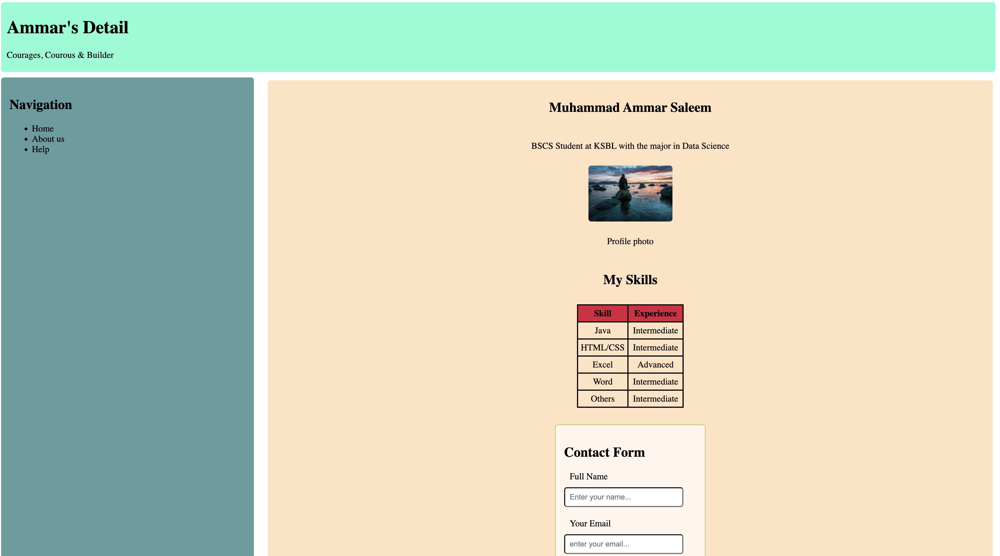
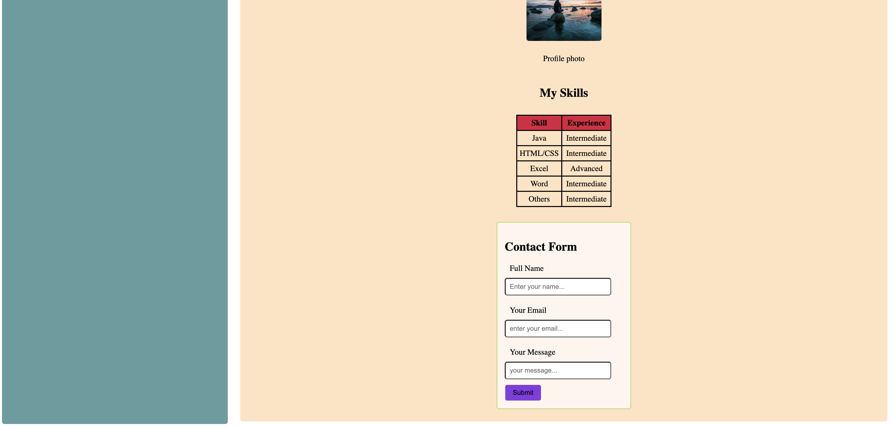

---

## 🗂️ lab09 — CSS Grid Layouts

Two exercises exploring `grid-template-areas`:

### `grid-asymmetric-boxes`
Five boxes arranged in an irregular grid using named areas and empty cells (`.`).

**Screenshot:**

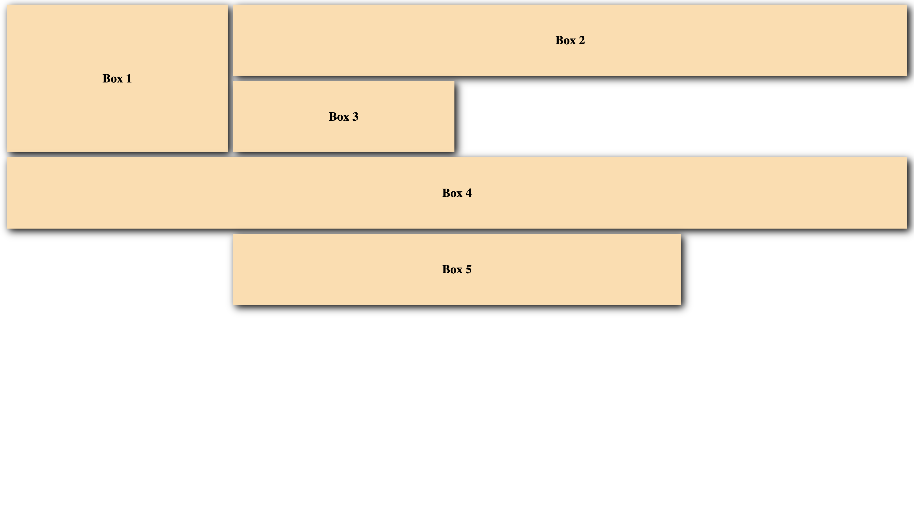

### `grid-dashboard-layout`
A classic header/sidebar/main/footer page structure using CSS Grid.

**Screenshot:**

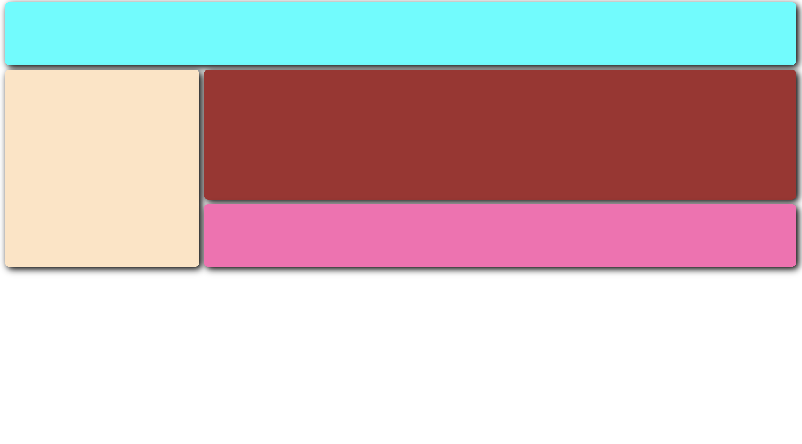

---

## 🗂️ Lab10 — Course Dashboard Layouts

Two variations of a course-listing dashboard, each demonstrating a different layout and hover-interaction approach.

### `course-dashboard-ksbl`
Teal header with logo, cream sidebar navigation, light-blue course cards.

**Screenshot:**

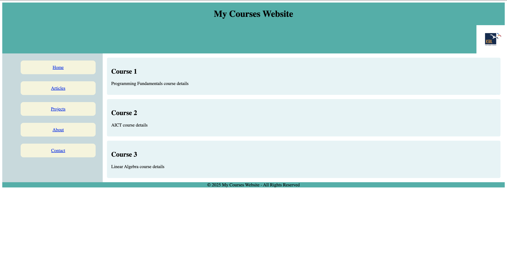

### `course-sidebar-hover-demo`
Brown header, aquamarine sidebar with red nav buttons, yellow course cards with hover states.

**Screenshot:**

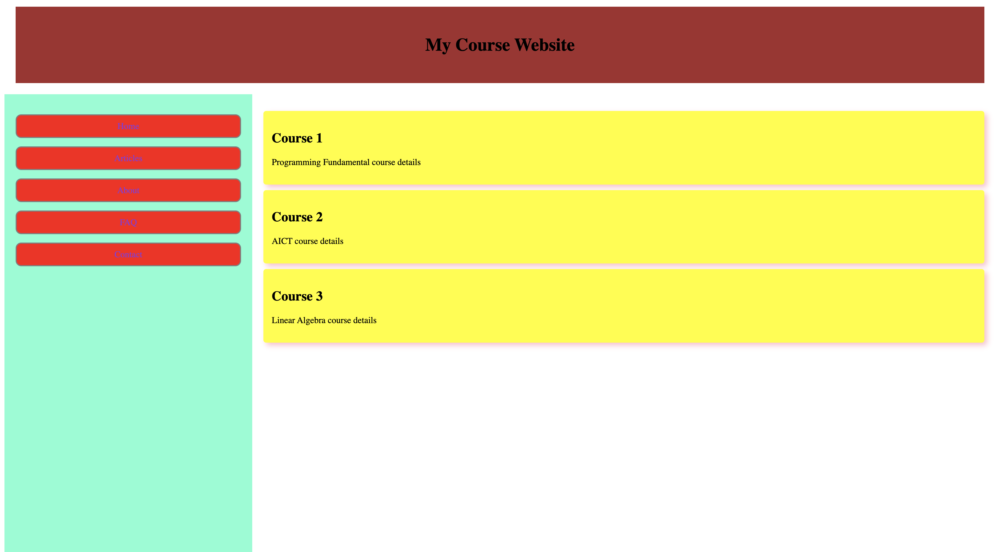
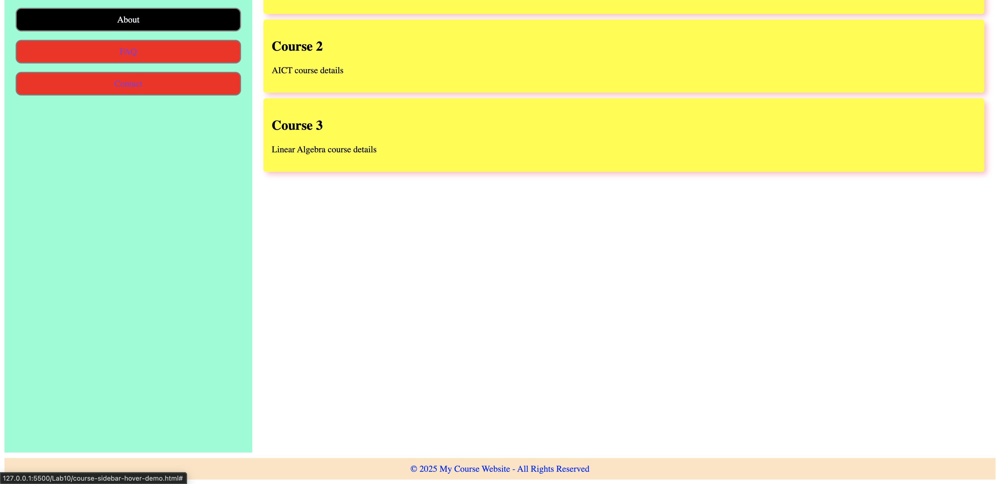

---

## 🗂️ Lab11JS — JavaScript DOM Basics

Three small, focused JavaScript exercises:

### `dom-manipulation-basics`
Covers `getElementById`, `.innerHTML`, `.style`, a color picker, and range-slider-based resizing of a `<div>`.

### `interactive-css-styler`
A live CSS playground — sliders and color pickers control a box's background, border, radius, size, and shadow in real time.

**Screenshot:**

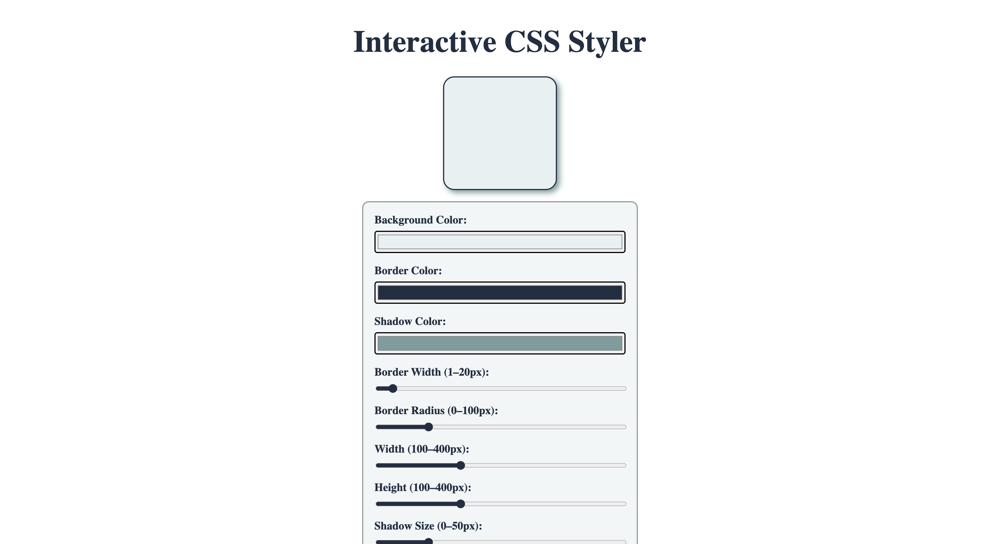
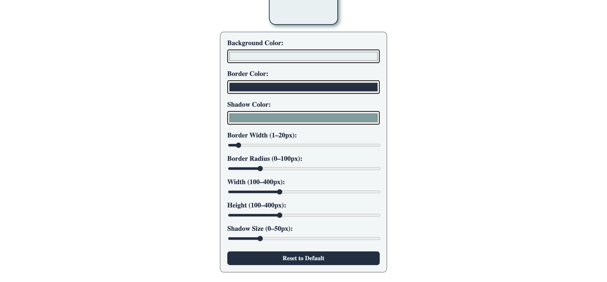

### `button-color-toggle`
A single button that cycles through three background colors on click.


---

## 🗂️ Lab12JS — Photo Gallery Carousel

`photo-gallery-carousel` — A styled photo carousel with Previous/Next navigation, a title and description panel, and an image counter.

**Screenshot:**

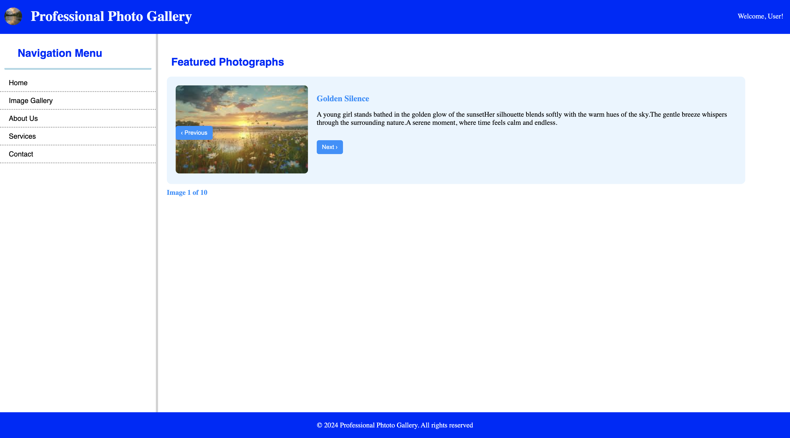

---

## 🗂️ Lab13JS — Filterable Gallery + Positioning Demo

### `css-positioning-demo`
Demonstrates `position: absolute` / `relative`, plus centering an element with `transform: translate(-50%, -50%)`.

### `photo-gallery-filterable`
An expanded photo gallery (23 images) with a category filter sidebar (Cars, Bikes, Lion, Aesthetics) alongside Previous/Next navigation.

**Screenshot:**

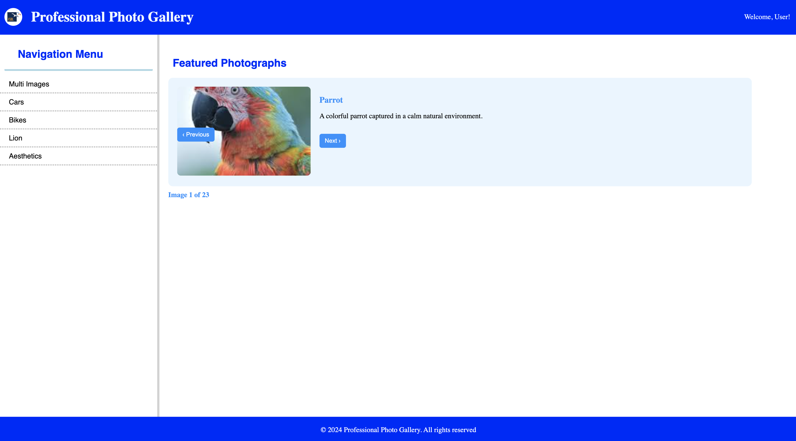

---

## 🗂️ Quiz — Interactive Box Cycling

A 5-box diamond-pattern layout. Clicking the **Click** button advances a highlighted box through a set sequence — the currently active box turns dark navy while the rest stay blue, and the highlight moves to the next box in line each time the button is pressed (wrapping back to the start after the last box).

**Screenshot:**

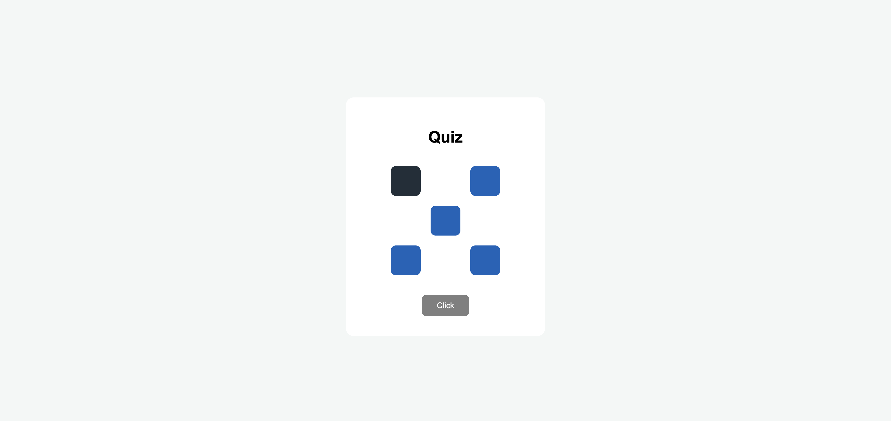

---

## 🛠️ Built With

- HTML5
- CSS3 (Flexbox, Grid, positioning, transitions)
- Vanilla JavaScript (DOM manipulation, event listeners, array-based state cycling)

## 📌 Notes

Each folder is a standalone exercise — open the corresponding `.html` file directly in a browser to view it.
